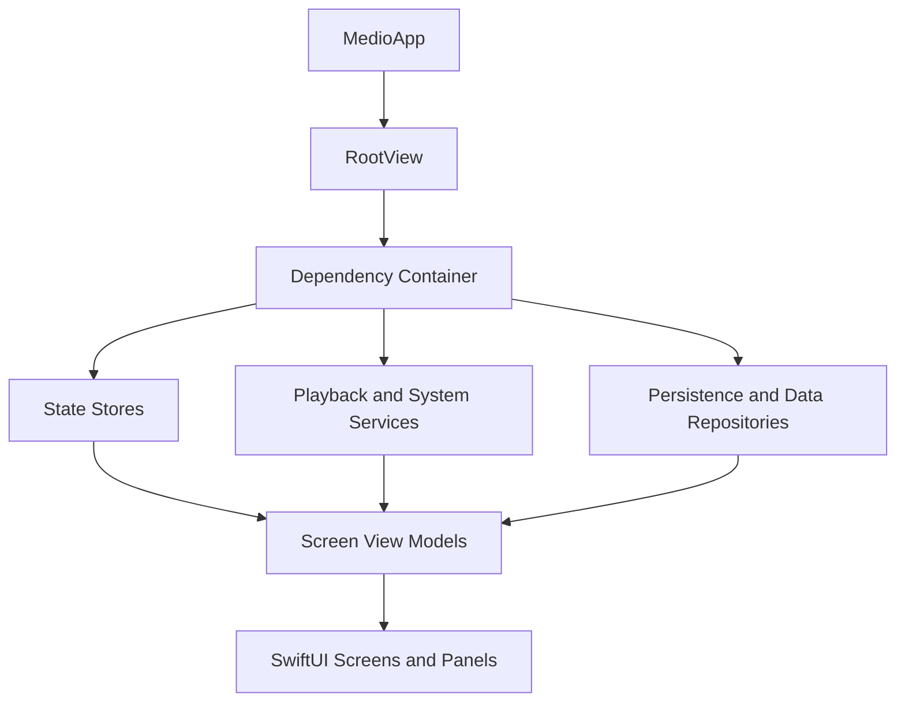

# App Architecture

Medio is a SwiftUI app with a small dependency container, observable stores, use cases for domain actions, repositories for persistence/data access, and screen view models for UI orchestration.

## Runtime Shape

## Core Layers

- [[Dependency Container]] wires single runtime instances.
- [[State Stores]] hold observable app state.
- [[Navigation and Screens]] owns tabs, sheet stacks, route view-model caching, and screen composition.
- [[Library Indexing]] creates derived media collections.
- [[Playback Pipeline]] serializes queue/player operations.
- [[Persistence]] stores cache, settings, favorites, lyrics, history, and overrides.

## Architectural Style

The code favors direct SwiftUI composition and domain-specific use cases over a heavy framework. `@MainActor` is used for UI-facing state and playback orchestration, while scanning and persistence work move into actors, detached tasks, locks, or repositories where needed.

## Main Entry Points

- `Sources/MedioApp.swift`
- `Sources/RootView.swift`
- `Sources/AppContainer.swift`
- `Sources/AppRouter.swift`
- `Sources/Stores.swift`
- `Sources/ViewModels.swift`

See [[Source Map]] for the full file index.

