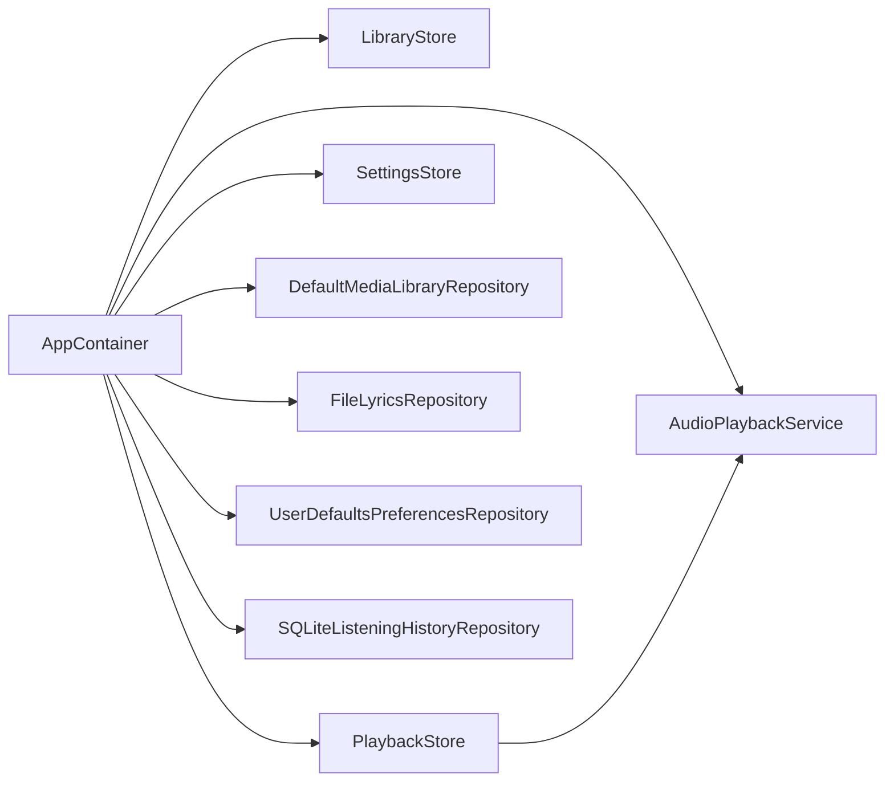

# Dependency Container

`AppContainer` is the runtime composition root. It constructs stores, repositories, playback services, system UI services, notifications, now-playing integration, remote commands, and startup coordination.

## Responsibilities

- Create long-lived [[State Stores]]: `LibraryStore`, `PlaybackStore`, and `SettingsStore`.
- Select real or in-memory implementations when `AppRuntime.isUITesting` is active.
- Connect `PlaybackStore` to the selected `PlaybackService`.
- Provide repositories used by [[Library Indexing]], [[Lyrics System]], [[Metadata and Artwork]], [[Persistence]], and [[Queue and Favorites]].

## Important Wiring

## Test Switches

When UI testing is active, the container uses:

- `UITestMediaLibraryRepository`
- `InMemoryPlaybackService`
- `InMemoryFavoritesRepository`

This keeps [[Testing and Diagnostics]] deterministic and avoids depending on the live user library.

## Source

- `Sources/AppContainer.swift`
- `Sources/AppInfrastructure.swift`
- `Sources/Stores.swift`

