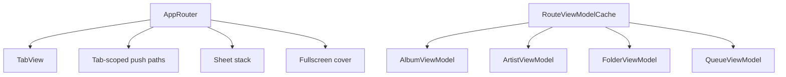

# Navigation and Screens

Navigation is tab-first, with sheet routes and tab-scoped push stacks managed by `AppRouter`. `RootView` builds long-lived view models and uses a route view-model cache for expensive detail screens.

## Top-Level Tabs

- Home -> [[Home and Library Browsing]]
- Library -> [[Home and Library Browsing]]
- Playground -> diagnostics and experimental library controls
- Search -> [[Search]]

## Route Types

`AppTab` and `SheetRoute` describe the app's navigation vocabulary. Routes cover now playing, queue, settings, favorites, folder panels, album panels, artist panels, file-about panels, move/create flows, and fullscreen video.

## Composition Model

## Design Notes

- `RootView` owns app-wide view models so state survives tab switches.
- Detail view models are cached by route identity to avoid losing detail state during navigation.
- Launch arguments can select initial tab/route for UI tests and debugging.

## Source

- `Sources/AppRouter.swift`
- `Sources/AppRoutes.swift`
- `Sources/RootView.swift`
- `Sources/AppScreens.swift`
- `Sources/AppPanels.swift`

