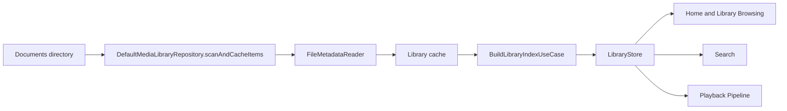

# Library Indexing

Library indexing turns the filesystem into navigable app concepts: folders, songs, albums, artists, and search text.

## Pipeline

## Key Behavior

- The repository loads a JSON cache first for fast startup.
- If no cache exists, it scans Documents and writes a cache.
- Scans skip internal folders such as `Lyrics`, `Users`, cache JSON, hidden files, and starter files.
- Metadata is reused when file size and modification time match cached records.
- `BuildLibraryIndexUseCase` ensures folder chains exist, derives songs, albums, artists, and rebuilds `LibrarySearchTextIndex`.

## Artist and Album Semantics

Album grouping uses `album ?? "Unknown Album"`. Artist grouping splits combined artist strings while preserving known exception names such as `Tyler, The Creator` and `Earth, Wind & Fire`.

## Connected Notes

- [[Metadata and Artwork]]
- [[Home and Library Browsing]]
- [[Search]]
- [[Persistence]]
- [[Source Map]]

## Source

- `Sources/MediaLibraryRepository.swift`
- `Sources/BuildLibraryIndexUseCase.swift`
- `Sources/FileMetadataReader.swift`
- `Sources/ScanLibraryUseCase.swift`
- `Sources/Stores.swift`

