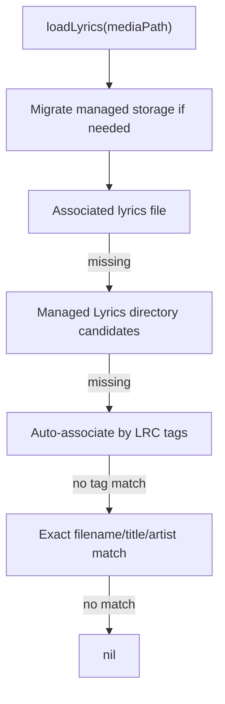

# Lyrics System

The lyrics system manages local lyric text, associated external lyric files, search indexing, missing-lyrics scanning, and organized lyrics storage.

## Lookup Order

## Storage Model

- Managed lyrics live under the app's Documents `Lyrics/` folder.
- Associations are stored through `LyricsFileAssociationRepository`.
- Search uses batch loading to avoid per-song metadata work across large libraries.
- Supported text decoding includes UTF-8, UTF-16 variants, and ISO Latin 1.

## Missing Lyrics

`MissingLyricsScanner` can identify songs without lyrics and optionally use speech detection to avoid flagging instrumental tracks. This connects lyrics quality to [[Search]] and library hygiene.

## Connected Notes

- [[Search]]
- [[Persistence]]
- [[Metadata and Artwork]]
- [[Testing and Diagnostics]]

## Source

- `Sources/LyricsRepository.swift`
- `Sources/FileLyricsRepository.swift`
- `Sources/LyricsFileAssociationRepository.swift`
- `Sources/LyricsOrganizationService.swift`
- `Sources/MissingLyricsService.swift`

