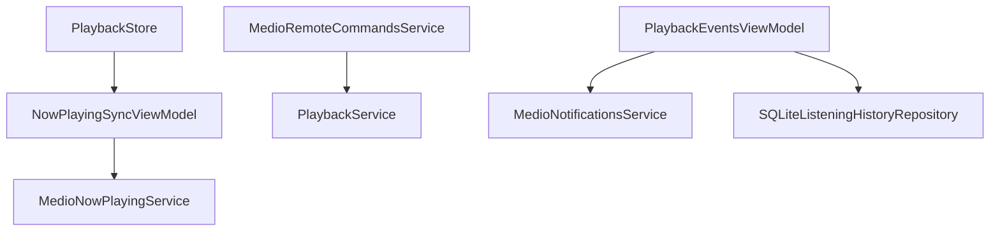

# Now Playing and System Integration

This domain keeps internal playback state synchronized with system surfaces: Now Playing metadata, remote commands, notifications, video presentation, and audio session behavior.

## System Touchpoints

- `AVAudioSession` setup in [[Playback Pipeline]].
- Now Playing metadata via `NowPlayingService`.
- Remote command callbacks via `RemoteCommandsService`.
- Playback notifications through `NotificationsService`.
- Listening history through [[Persistence]].
- Fullscreen video route through [[Navigation and Screens]].

## Runtime Relationship

## Design Notes

- `NowPlayingViewModel` serves the full now-playing screen and lyric display.
- `NowPlayingSyncViewModel` focuses on system metadata synchronization.
- Playback events are separated from player mechanics so [[Playback Pipeline]] stays centered on queue and AVQueuePlayer state.

## Source

- `Sources/NowPlaying.swift`
- `Sources/NowPlayingPanel.swift`
- `Sources/Notifications.swift`
- `Sources/AudioPlaybackService.swift`
- `Sources/ListeningHistory.swift`

