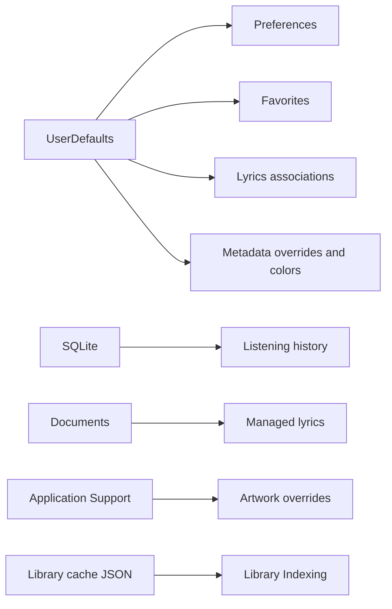

# Persistence

Medio uses several storage strategies rather than one global database. The split keeps each concern simple and lets UI tests swap implementations.

## Persistence Map

## Repositories

- `UserDefaultsPreferencesRepository` backs [[State Stores]] settings.
- `UserDefaultsFavoritesRepository` backs [[Queue and Favorites]].
- `SQLiteListeningHistoryRepository` backs [[Now Playing and System Integration]] and recap exports.
- `FileLyricsRepository` backs [[Lyrics System]].
- `DefaultMediaLibraryRepository` owns library cache storage for [[Library Indexing]].

## Path Stability

`PersistedMediaPath` and `AppFilePathPolicy` normalize paths and define the Documents boundary. Stable identities help persisted records survive ordinary path representation differences.

## Source

- `Sources/UserDefaultsPreferencesRepository.swift`
- `Sources/UserDefaultsFavoritesRepository.swift`
- `Sources/SQLiteListeningHistoryRepository.swift`
- `Sources/FileLyricsRepository.swift`
- `Sources/AppInfrastructure.swift`

