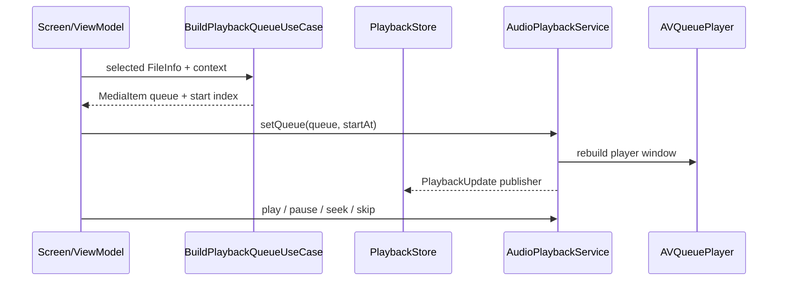

# Playback Pipeline

Playback starts when a selected file is converted into a context queue and passed to a `PlaybackService`. The real service is `AudioPlaybackService`, backed by `AVQueuePlayer`.

## Runtime Flow

## Queue Model

`AudioPlaybackService` keeps:

- `originalQueue` for canonical order.
- `order` mapping visible queue index to original index.
- `queue` as the visible order.
- `currentIndex` for the visible queue.
- a small AV player window so the entire queue does not need to be loaded into the player at once.

## Important Behaviors

- Operations are serialized with `lastOperation` to avoid race conditions from rapid commands.
- Repeat-one restarts the current item.
- Repeat-all wraps from end to beginning.
- Shuffle uses a seed and preserves current original item when toggled.
- The service publishes immediately on queue changes so UI can update before AVQueuePlayer finishes rebuilding.

## Connected Notes

- [[Queue and Favorites]]
- [[Now Playing and System Integration]]
- [[State Stores]]
- [[Testing and Diagnostics]]

## Source

- `Sources/AudioPlaybackService.swift`
- `Sources/PlayMediaUseCase.swift`
- `Sources/QueueUseCases.swift`
- `Sources/Stores.swift`
- `Sources/NowPlaying.swift`

