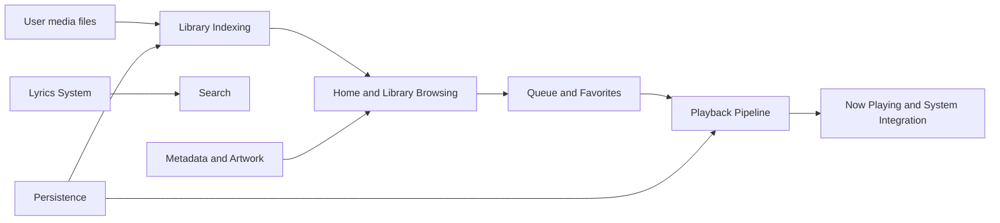

# Medio Notes

This vault is a graph-first map of [[Medio Product Brief|Medio]], the iOS media library app in this workspace.

## Start Here

- [[Medio Atlas]] is the main map of the vault.
- [[Graph View Guide]] explains how to make the graph useful.
- [[App Architecture]] shows how the app is wired.
- [[Source Map]] links concepts back to Swift source files.

## Core Loops

## Graph Hubs

- [[App Architecture]]
- [[Library Indexing]]
- [[Playback Pipeline]]
- [[Lyrics System]]
- [[Metadata and Artwork]]
- [[Navigation and Screens]]
- [[State Stores]]
- [[Persistence]]

